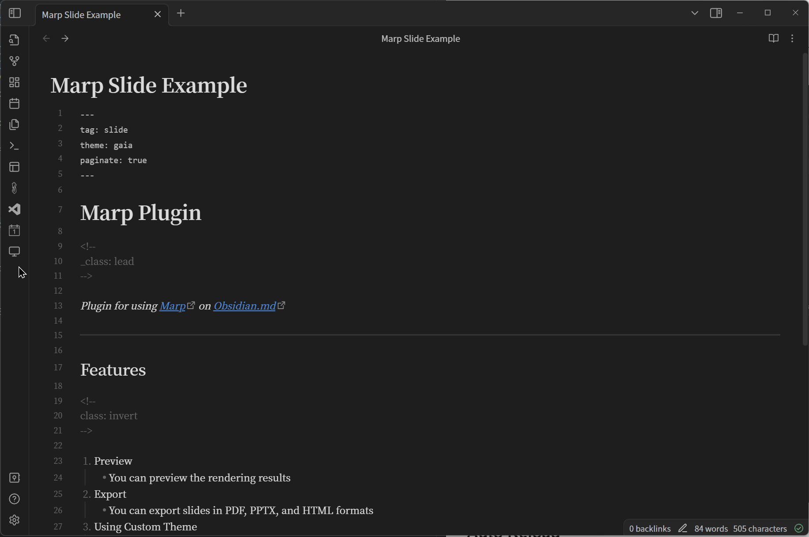
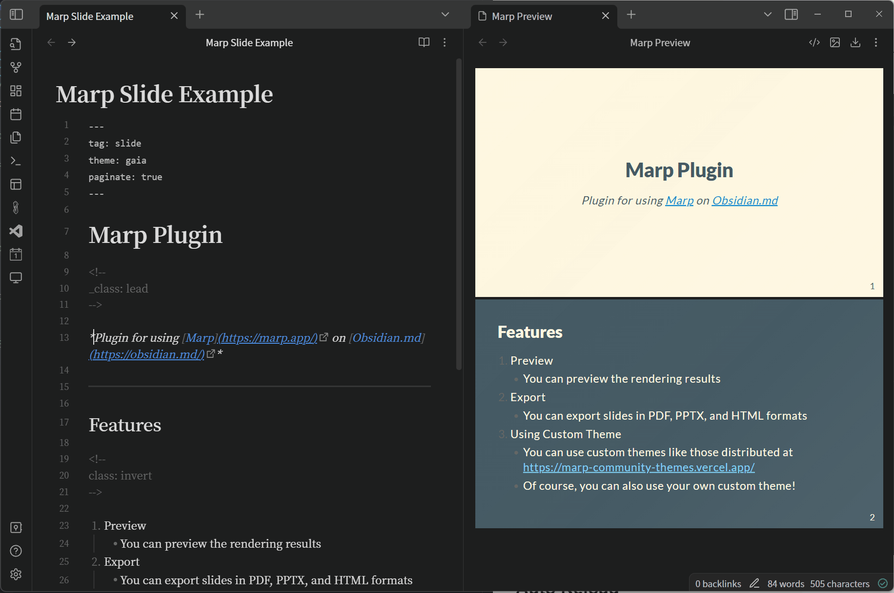
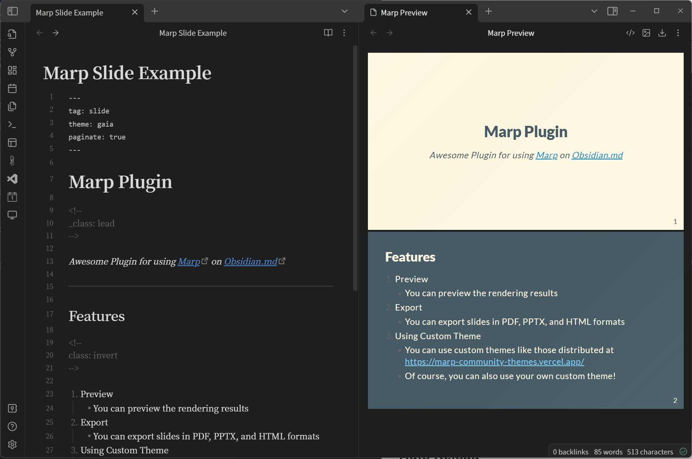
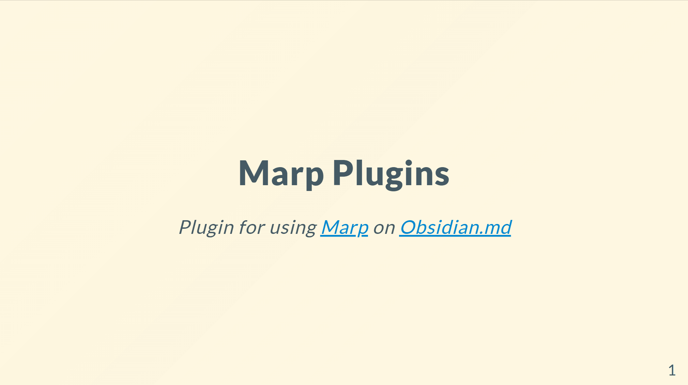
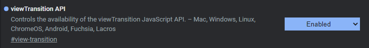

# Obsidian Marp Plugin

Plugin to use [Marp](https://marp.app/) with [Obsidian.md](https://obsidian.md/).

## Open the Preview

Select the tab for the Markdown file, then click the button on the ribbon or run `Marp: Open Preview` from the command palette to see a preview.



### Auto Reload



## Export Slides

**You need to have Node.js installed to export slides, as this plugin uses the `npx` command to export slides.**  
You can choose your preferred format from PDF, PPTX and HTML.  
**The output is always to the `Downloads` directory.**



## Embed Images

When exporting, images are converted to Base64 and embedded in the file, so you can share slides with embedded local images.  
The image path can be an absolute or relative path from the root of the vault.  
The Wikilink format (`![[path/to/image.png]]`) will **NOT** work for slides, **you must use the CommomMark format (``)**.

## Transition



Transitions can be used by exporting in HTML format.
However, you need to set the `viewTransition API` to `Enable` in Chrome 110.
(Not required if you are using the beta version (111+) of Chrome.)



## Settings

### Enable Auto Reload

type: toggle  
default: on

If on, the preview will be updated automatically when the Markdown file is saved.

### Enable Open Preview in Split Tab

type: toggle  
default: on

Enables the ability to open previews in split tabs. If disabled, a new tab will be created in the same split as the markdown file.

### Theme Folder Location

type: text
default: `MarpTheme`

Specify the relative path to the directory where the theme is stored. By saving the css files in the specified directory, Marp can use a custom theme.

**\*Obsidian must be restarted after adding css.**

#### Example: If you set `MarpTheme` as `Theme Folder Location`

```text
<your-vault>
└── MarpTheme  ← Make this directory
    ├── beamer.css  ← Then save custom css here!
    ├── border.css
    └── gradient.css
```
